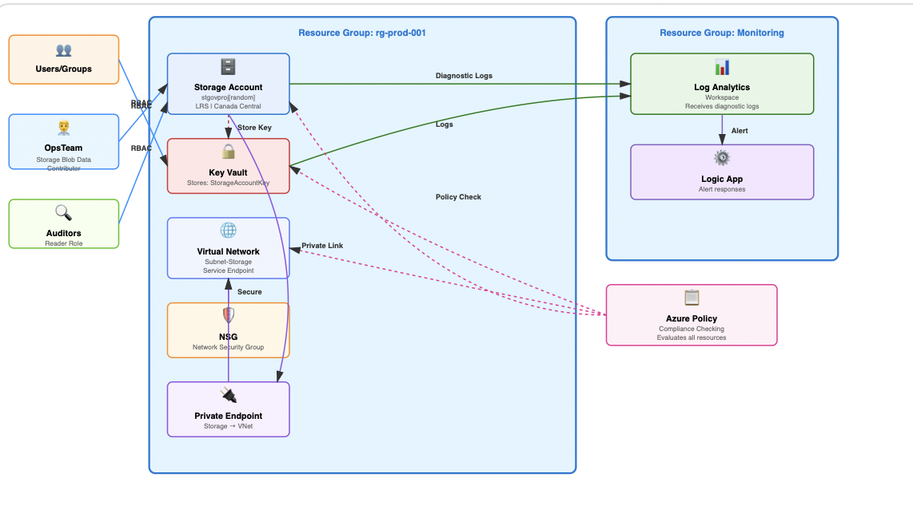

# azure-governance-security-project
Secure Azure governance architecture with identity controls, policy enforcement, and compliance monitoring


# Secure Azure Governance & Security Architecture

A hands-on project demonstrating Azure governance, identity management, policy enforcement, and security monitoring.

## 📋 Table of Contents
- [Overview](#overview)
- [Architecture](#architecture)
- [Components](#components)
- [Key Features](#key-features)
- [QA Testing Approach](#qa-testing-approach)
- [Setup Instructions](#setup-instructions)
- [Lessons Learned](#lessons-learned)
- [Skills Demonstrated](#skills-demonstrated)

## Overview

This project implements a secure, compliant Azure environment for a fictional healthcare organization. It demonstrates:
- Identity and access management using Entra ID and RBAC
- Governance through Azure Policy
- Secrets management with Key Vault
- Security monitoring and automated incident response

**Tech Stack:** Azure, Entra ID, Azure Policy, Key Vault, Log Analytics, Logic Apps, KQL

## Architecture



The architecture consists of three resource groups (Production, Development, Shared) with layered security controls:
- Role-based access control (RBAC)
- Policy-enforced compliance
- Centralized secrets management
- Comprehensive logging and monitoring

## Components

### 1. Identity & Access Management
- **Entra ID Users & Groups:** Created role-based groups (DevTeam, OpsTeam, Auditors)
- **RBAC Assignments:** Least-privilege access to resource groups
- **Privileged Identity Management:** Just-in-time access for administrative roles *(documented for future implementation)*

### 2. Governance & Compliance
- **Azure Policy:**
  - Allowed Locations (Canada Central/East only)
  - Required Tags (Environment tagging)
  - Audit Public IPs
- **Compliance Dashboard:** Tracks policy adherence across all resources

### 3. Security & Secrets
- **Azure Key Vault:** Centralized secrets storage
  - Database connection strings
  - API keys
  - Storage account keys
- **Access Policies:** Group-based permissions with audit logging

### 4. Monitoring & Logging
- **Log Analytics Workspace:** Centralized log collection
- **Diagnostic Logs:** Enabled for Key Vault, Resource Groups, Activity Logs
- **KQL Queries:** Custom queries for security analysis (see `/kql-queries`)

### 5. Security Automation
- **Logic App:** Automated alert for resource deletions
- Sends email notification with resource details and actor information

### 6. Sample Workload
- **Azure Storage Account:** Production workload with all controls applied
  - RBAC-protected access
  - Keys stored in Key Vault
  - Diagnostic logging enabled
  - Policy compliance verified

## Key Features

✅ **Least-Privilege Access:** Users can only access resources necessary for their role  
✅ **Policy Enforcement:** Automated compliance checks prevent misconfigurations  
✅ **Secrets Protection:** No hardcoded credentials; all secrets in Key Vault  
✅ **Full Audit Trail:** Complete logging of access and changes  
✅ **Automated Response:** Security events trigger immediate notifications  

## QA Testing Approach

Coming from a QA background, I validated each control systematically:

### Identity Testing
- **Test Case 1:** DevUser accessing Dev resources → ✅ Pass
- **Test Case 2:** DevUser accessing Prod resources → ✅ Deny (as expected)
- **Test Case 3:** Auditor modifying resources → ✅ Deny (read-only enforced)

See [TESTING.md](TESTING.md) for complete test results.

### Policy Testing
- Attempted to create resources in non-allowed regions → ✅ Blocked by policy
- Created resources without required tags → ✅ Blocked by policy
- Verified compliance dashboard accurately reflects violations

### Access Testing
- OpsTeam accessing Key Vault secrets → ✅ Allowed
- DevTeam accessing Key Vault secrets → ✅ Denied
- Monitored access in Log Analytics → ✅ All access logged

### Automation Testing
- Deleted test resource → ✅ Alert email received within 5 minutes
- Verified alert contained correct resource details

## Setup Instructions

### Prerequisites
- Azure subscription (free trial works)
- Basic understanding of Azure Portal

### Deployment Steps

1. **Clone this repository:**
```bash
git clone https://github.com/your-username/azure-governance-security-project.git
```

2. **Create Resource Groups:**
```bash
az group create --name rg-prod-001 --location canadacentral
az group create --name rg-dev-001 --location canadacentral
az group create --name rg-shared-001 --location canadacentral
```

3. **Apply Policies:**
- Import policies from `/policies` folder
- Assign to subscription scope

4. **Configure Identities:**
- Create users and groups in Entra ID
- Assign RBAC roles as documented

5. **Deploy Key Vault:**
```bash
az keyvault create --name kv-governance-proj --resource-group rg-shared-001 --location canadacentral
```

6. **Enable Logging:**
- Create Log Analytics workspace
- Configure diagnostic settings for all resources

7. **Deploy Logic App:**
- Import Logic App definition
- Configure email notifications

## Lessons Learned

### Technical Insights
- **RBAC vs Entra Roles:** Understanding when to use each was critical
- **Policy Effects:** "Audit" vs "Deny" - chose deny for critical controls, audit for monitoring
- **KQL Learning Curve:** Complex queries require practice, but essential for security analysis

### QA Perspective
- Testing cloud infrastructure requires different approach than application testing
- Access control validation is similar to permissions testing in applications
- Documentation is crucial - policies without testing proof aren't credible

### Challenges Overcome
- **Challenge:** Key Vault access policies initially too permissive  
  **Solution:** Implemented least-privilege model based on job role
  
- **Challenge:** Policy assignments not taking effect immediately  
  **Solution:** Learned about policy evaluation timing and compliance scanning

## Skills Demonstrated

### Cloud Technologies
- Azure Portal navigation and resource management
- Entra ID (Azure AD) identity configuration
- Azure Policy creation and enforcement
- Azure Key Vault secrets management
- Log Analytics and KQL query writing
- Logic Apps workflow automation

### Security & Governance
- Role-Based Access Control (RBAC) design
- Least-privilege access principles
- Compliance monitoring and reporting
- Security audit logging
- Incident response automation

### QA & Testing
- Infrastructure testing methodology
- Access control validation
- Negative testing (deny scenarios)
- Compliance verification
- Documentation of test results

## Next Steps

In a production environment, I would enhance this with:
- [ ] Azure Blueprints for repeatable deployments
- [ ] More granular RBAC with custom roles
- [ ] Integration with SIEM for advanced threat detection
- [ ] Backup and disaster recovery policies
- [ ] Cost management and optimization
- [ ] Multi-region deployment with geo-redundancy

Harneet kaur
[LinkedIn]([your-linkedin-url](https://www.linkedin.com/in/harneet-kaur-55a692146/) | [GitHub](your-github-url) |

---

*This project was built as part of my transition from QA Engineering to Cloud Infrastructure, combining 6+ years of testing expertise with cloud security and governance skills.*
